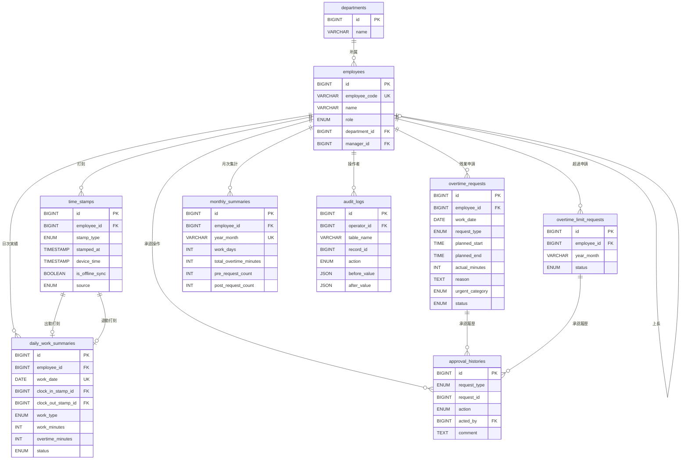

```mermaid
erDiagram
    departments ||--o{ employee_assignments : "配属"
    departments ||--o| departments : "親部署"
    employees ||--o{ employee_assignments : "所属履歴"
    employees ||--o{ stamp_events : "打刻"
    employees ||--o{ daily_records : "日次実績"
    employees ||--o{ workflow_requests : "申請"
    employees ||--o{ approval_events : "承認操作"
    employees ||--o{ monthly_summaries : "月次集計"
    employees ||--o{ notifications : "通知"
    employees ||--o{ audit_logs : "操作者"
    work_patterns ||--o{ daily_records : "勤務形態"
    stamp_events ||--o| daily_records : "出勤イベント"
    stamp_events ||--o| daily_records : "退勤イベント"
    workflow_requests ||--o{ workflow_request_details : "詳細"
    workflow_requests ||--o{ approval_events : "承認履歴"
    approval_steps ||--o{ approval_events : "ステップ"
    company_calendar }o--|| daily_records : "カレンダー参照"

    employees {
        BIGINT id PK
        VARCHAR employee_code UK
        VARCHAR name
        VARCHAR email UK
    }

    departments {
        BIGINT id PK
        VARCHAR name
        BIGINT parent_id FK
    }

    employee_assignments {
        BIGINT id PK
        BIGINT employee_id FK
        BIGINT department_id FK
        BIGINT manager_id FK
        ENUM role
        DATE effective_from
        DATE effective_to
    }

    work_patterns {
        BIGINT id PK
        VARCHAR name
        TIME start_time
        TIME end_time
        INT standard_work_minutes
    }

    stamp_events {
        BIGINT id PK
        BIGINT employee_id FK
        ENUM event_type
        TIMESTAMP server_time
        TIMESTAMP device_time
        JSON metadata
    }

    daily_records {
        BIGINT id PK
        BIGINT employee_id FK
        DATE work_date UK
        BIGINT work_pattern_id FK
        ENUM work_type
        INT work_minutes
        INT overtime_minutes
        INT late_night_minutes
    }

    workflow_requests {
        BIGINT id PK
        ENUM request_category
        BIGINT employee_id FK
        DATE target_date
        ENUM status
        BIGINT current_approver_id FK
    }

    workflow_request_details {
        BIGINT id PK
        BIGINT request_id FK
        VARCHAR field_key
        TEXT field_value
    }

    approval_steps {
        BIGINT id PK
        ENUM request_category
        INT step_order
        ENUM approver_role
    }

    approval_events {
        BIGINT id PK
        BIGINT request_id FK
        BIGINT step_id FK
        ENUM action
        BIGINT acted_by FK
        TEXT comment
    }

    monthly_summaries {
        BIGINT id PK
        BIGINT employee_id FK
        VARCHAR year_month UK
        INT total_overtime_minutes
        INT pre_request_count
        INT post_request_count
    }

    notifications {
        BIGINT id PK
        BIGINT recipient_id FK
        ENUM notification_type
        VARCHAR title
        BOOLEAN is_read
    }

    company_calendar {
        BIGINT id PK
        DATE calendar_date UK
        ENUM day_type
    }

    audit_logs {
        BIGINT id PK
        BIGINT operator_id FK
        VARCHAR table_name
        BIGINT record_id
        JSON before_value
        JSON after_value
    }
```

# 勤怠管理システム データモデル設計書

| 項目 | 内容 |
|------|------|
| 文書ID | DM-001 |
| 作成日 | 2026-02-13 |
| 準拠要件 | requirement_v3.md（REQ-DOC-001 v3.0） |

---

## 案A: シンプル型（テーブル数最小・小規模向け）

### 1. 設計思想と適用シーン

**設計思想:** 「1従業員1日1レコード」を基本に、打刻・残業申請・勤務実績を1テーブルに集約する。テーブル数を最小限に抑え、SQLの結合を減らすことでシンプルさと高速性を両立する。

**適用シーン:**
- 従業員50名以下の小規模事業所
- 短期間での開発・リリースが求められるケース
- 既存の給与システムへCSV連携が主目的のケース
- 開発チームが1〜2名の小規模プロジェクト

**テーブル数:** 5テーブル

### 2. テーブル定義

```yaml
tables:
  # ── 従業員マスタ ──
  employees:
    description: 従業員情報と認証情報を一体管理
    columns:
      - name: id
        type: BIGINT
        pk: true
        auto_increment: true
      - name: employee_code
        type: VARCHAR(20)
        unique: true
        not_null: true
        description: 社員番号
      - name: name
        type: VARCHAR(100)
        not_null: true
      - name: email
        type: VARCHAR(255)
        unique: true
        not_null: true
      - name: password_hash
        type: VARCHAR(255)
        not_null: true
        description: "REQ-041: bcryptハッシュ"
      - name: role
        type: ENUM('employee', 'manager', 'hr', 'admin')
        not_null: true
        default: "'employee'"
        description: "REQ-029: ロールベースアクセス制御"
      - name: department_id
        type: BIGINT
        fk: departments.id
        not_null: true
      - name: manager_id
        type: BIGINT
        fk: employees.id
        nullable: true
        description: 直属上長のID
      - name: is_active
        type: BOOLEAN
        default: "true"
      - name: created_at
        type: TIMESTAMP
        not_null: true
      - name: updated_at
        type: TIMESTAMP
        not_null: true
    indexes:
      - columns: [department_id]
      - columns: [manager_id]

  # ── 部署マスタ ──
  departments:
    description: 部署情報
    columns:
      - name: id
        type: BIGINT
        pk: true
        auto_increment: true
      - name: name
        type: VARCHAR(100)
        not_null: true
      - name: is_active
        type: BOOLEAN
        default: "true"
      - name: created_at
        type: TIMESTAMP
        not_null: true

  # ── 日次勤怠レコード（打刻＋勤務実績を集約） ──
  daily_attendances:
    description: "1従業員1日1レコード。打刻・残業申請・勤務時間を一体管理"
    columns:
      - name: id
        type: BIGINT
        pk: true
        auto_increment: true
      - name: employee_id
        type: BIGINT
        fk: employees.id
        not_null: true
      - name: work_date
        type: DATE
        not_null: true
        description: "REQ-034: 勤務日（出勤打刻日基準）"
      - name: clock_in_at
        type: TIMESTAMP
        nullable: true
        description: "REQ-002: サーバー側タイムスタンプ"
      - name: clock_out_at
        type: TIMESTAMP
        nullable: true
      - name: clock_in_device_time
        type: TIMESTAMP
        nullable: true
        description: "REQ-035: オフライン時の端末時刻"
      - name: clock_out_device_time
        type: TIMESTAMP
        nullable: true
      - name: work_type
        type: ENUM('normal', 'holiday', 'correction')
        default: "'normal'"
        description: "REQ-038: 勤務区分"
      - name: work_minutes
        type: INT
        default: "0"
        description: 実勤務時間（分）
      - name: overtime_minutes
        type: INT
        default: "0"
        description: 残業時間（分）
      - name: overtime_request_type
        type: ENUM('none', 'pre', 'post')
        default: "'none'"
        description: "REQ-006/007: 残業申請種別"
      - name: overtime_planned_start
        type: TIME
        nullable: true
        description: "REQ-008: 予定残業開始"
      - name: overtime_planned_end
        type: TIME
        nullable: true
      - name: overtime_reason
        type: TEXT
        nullable: true
      - name: overtime_urgent_category
        type: ENUM('customer', 'system_failure', 'deadline', 'other')
        nullable: true
        description: "REQ-007: 緊急事由（事後申請時必須）"
      - name: approval_status
        type: ENUM('none', 'pending', 'approved', 'rejected', 'returned')
        default: "'none'"
        description: "REQ-009: 承認状態"
      - name: approved_by
        type: BIGINT
        fk: employees.id
        nullable: true
      - name: approval_comment
        type: TEXT
        nullable: true
      - name: approved_at
        type: TIMESTAMP
        nullable: true
      - name: is_correction
        type: BOOLEAN
        default: "false"
        description: "REQ-005: 手動補正フラグ"
      - name: created_at
        type: TIMESTAMP
        not_null: true
      - name: updated_at
        type: TIMESTAMP
        not_null: true
    indexes:
      - columns: [employee_id, work_date]
        unique: true
      - columns: [work_date]
      - columns: [approval_status]
    constraints:
      - "REQ-004: UNIQUE(employee_id, work_date)で重複打刻防止"

  # ── 残業上限超過申請 ──
  overtime_limit_requests:
    description: "REQ-011/013: 月45時間超過の人事部承認"
    columns:
      - name: id
        type: BIGINT
        pk: true
        auto_increment: true
      - name: employee_id
        type: BIGINT
        fk: employees.id
        not_null: true
      - name: year_month
        type: VARCHAR(7)
        not_null: true
        description: "対象年月 (YYYY-MM)"
      - name: requested_by
        type: BIGINT
        fk: employees.id
        not_null: true
        description: 申請者（上長）
      - name: current_overtime_minutes
        type: INT
        not_null: true
      - name: reason
        type: TEXT
        not_null: true
      - name: status
        type: ENUM('pending', 'approved', 'rejected')
        default: "'pending'"
      - name: reviewed_by
        type: BIGINT
        fk: employees.id
        nullable: true
        description: 人事部承認者
      - name: review_comment
        type: TEXT
        nullable: true
      - name: created_at
        type: TIMESTAMP
        not_null: true
      - name: updated_at
        type: TIMESTAMP
        not_null: true

  # ── 操作ログ ──
  audit_logs:
    description: "REQ-022: 監査証跡"
    columns:
      - name: id
        type: BIGINT
        pk: true
        auto_increment: true
      - name: operator_id
        type: BIGINT
        fk: employees.id
        not_null: true
      - name: table_name
        type: VARCHAR(100)
        not_null: true
      - name: record_id
        type: BIGINT
        not_null: true
      - name: action
        type: ENUM('create', 'update', 'delete')
        not_null: true
      - name: before_value
        type: JSON
        nullable: true
      - name: after_value
        type: JSON
        nullable: true
      - name: created_at
        type: TIMESTAMP
        not_null: true
    indexes:
      - columns: [table_name, record_id]
      - columns: [operator_id]
      - columns: [created_at]
```

### 3. ER図


### 4. メリット・デメリット

| 観点 | 評価 |
|------|------|
| **メリット** | |
| クエリの単純さ | 日次の勤怠確認は `daily_attendances` の1テーブル参照で完結する |
| 開発速度 | テーブル数が少なく、CRUD実装が最小限で済む |
| パフォーマンス | JOINが少なく、単純なクエリは高速 |
| 学習コスト | テーブル構造が直感的で、新規メンバーの理解が容易 |
| **デメリット** | |
| NULLカラムの多さ | 残業申請がない日は残業関連カラムが全てNULLになり、データの意味が曖昧になる |
| 拡張性の低さ | 1日2回以上の出退勤（中抜け等）に対応できない。カラム追加でテーブルが肥大化する |
| 承認履歴の欠如 | 差戻し→再申請の履歴が残らず、最新状態しか保持できない（REQ-022の監査要件を満たしにくい） |
| 事後申請率の集計 | `overtime_request_type` で集計可能だが、申請日時の記録がないため REQ-042 の正確な算出にやや難あり |

### 5. 実装難易度

| 項目 | 評価 |
|------|------|
| DB設計 | 低 |
| バックエンドAPI | 低 |
| 承認ワークフロー | 中（差戻し履歴の管理に工夫が必要） |
| レポート・集計 | 低（1テーブルで集計可能） |
| **総合** | **低** |

---

## 案B: バランス型（正規化と実用性のバランス・一般向け）

### 1. 設計思想と適用シーン

**設計思想:** 打刻・残業申請・承認をそれぞれ独立テーブルに分離し、第3正規形を基本としつつ、集計用の非正規化カラム（月次サマリー）を戦略的に持たせる。「正しいデータ構造」と「実用的なクエリ性能」の両立を目指す。

**適用シーン:**
- 従業員50〜500名の中規模企業（ASM-001の想定規模に合致）
- requirement_v3.md の全要件を過不足なく満たす必要があるケース
- 3〜5名の開発チームで3〜6ヶ月の開発期間
- 既存の人事・給与システムとの連携を見据えた設計

**テーブル数:** 9テーブル

### 2. テーブル定義

```yaml
tables:
  # ── 従業員マスタ ──
  employees:
    description: 従業員情報
    columns:
      - name: id
        type: BIGINT
        pk: true
        auto_increment: true
      - name: employee_code
        type: VARCHAR(20)
        unique: true
        not_null: true
      - name: name
        type: VARCHAR(100)
        not_null: true
      - name: email
        type: VARCHAR(255)
        unique: true
        not_null: true
      - name: password_hash
        type: VARCHAR(255)
        not_null: true
      - name: role
        type: ENUM('employee', 'manager', 'hr', 'admin')
        not_null: true
        default: "'employee'"
      - name: department_id
        type: BIGINT
        fk: departments.id
        not_null: true
      - name: manager_id
        type: BIGINT
        fk: employees.id
        nullable: true
      - name: is_active
        type: BOOLEAN
        default: "true"
      - name: created_at
        type: TIMESTAMP
        not_null: true
      - name: updated_at
        type: TIMESTAMP
        not_null: true

  # ── 部署マスタ ──
  departments:
    description: 部署情報
    columns:
      - name: id
        type: BIGINT
        pk: true
        auto_increment: true
      - name: name
        type: VARCHAR(100)
        not_null: true
      - name: is_active
        type: BOOLEAN
        default: "true"
      - name: created_at
        type: TIMESTAMP
        not_null: true

  # ── 打刻レコード ──
  time_stamps:
    description: "REQ-001〜004: 打刻の生データ。1打刻1レコード"
    columns:
      - name: id
        type: BIGINT
        pk: true
        auto_increment: true
      - name: employee_id
        type: BIGINT
        fk: employees.id
        not_null: true
      - name: stamp_type
        type: ENUM('clock_in', 'clock_out')
        not_null: true
      - name: stamped_at
        type: TIMESTAMP
        not_null: true
        description: "REQ-002: サーバー側タイムスタンプ"
      - name: device_time
        type: TIMESTAMP
        nullable: true
        description: "REQ-035: オフライン時の端末時刻"
      - name: is_offline_sync
        type: BOOLEAN
        default: "false"
        description: "REQ-035: オフライン打刻の同期フラグ"
      - name: source
        type: ENUM('normal', 'correction', 'bulk_correction')
        default: "'normal'"
        description: "REQ-005/040: 打刻ソース"
      - name: created_at
        type: TIMESTAMP
        not_null: true
    indexes:
      - columns: [employee_id, stamped_at]
      - columns: [employee_id, stamp_type, stamped_at]

  # ── 日次勤務サマリー ──
  daily_work_summaries:
    description: "日次の勤務実績を集計。打刻データから算出し非正規化して保持"
    columns:
      - name: id
        type: BIGINT
        pk: true
        auto_increment: true
      - name: employee_id
        type: BIGINT
        fk: employees.id
        not_null: true
      - name: work_date
        type: DATE
        not_null: true
        description: "REQ-034: 勤務日"
      - name: clock_in_stamp_id
        type: BIGINT
        fk: time_stamps.id
        nullable: true
      - name: clock_out_stamp_id
        type: BIGINT
        fk: time_stamps.id
        nullable: true
      - name: work_type
        type: ENUM('normal', 'holiday', 'absence')
        default: "'normal'"
        description: "REQ-038: 勤務区分"
      - name: work_minutes
        type: INT
        default: "0"
      - name: overtime_minutes
        type: INT
        default: "0"
      - name: status
        type: ENUM('in_progress', 'completed', 'missing_clock_out')
        default: "'in_progress'"
        description: "REQ-036: 退勤未打刻の検知用"
      - name: created_at
        type: TIMESTAMP
        not_null: true
      - name: updated_at
        type: TIMESTAMP
        not_null: true
    indexes:
      - columns: [employee_id, work_date]
        unique: true
      - columns: [work_date, status]

  # ── 残業申請 ──
  overtime_requests:
    description: "REQ-006〜010: 残業申請（事前/事後）"
    columns:
      - name: id
        type: BIGINT
        pk: true
        auto_increment: true
      - name: employee_id
        type: BIGINT
        fk: employees.id
        not_null: true
      - name: work_date
        type: DATE
        not_null: true
      - name: request_type
        type: ENUM('pre', 'post')
        not_null: true
        description: "REQ-006/007: 事前/事後区分"
      - name: planned_start
        type: TIME
        nullable: true
        description: "REQ-008: 予定開始（事前申請）"
      - name: planned_end
        type: TIME
        nullable: true
        description: "REQ-008: 予定終了（事前申請）"
      - name: actual_minutes
        type: INT
        nullable: true
        description: "REQ-008: 実績時間（事後申請、分）"
      - name: reason
        type: TEXT
        not_null: true
      - name: urgent_category
        type: ENUM('customer', 'system_failure', 'deadline', 'other')
        nullable: true
        description: "REQ-007: 緊急事由（事後申請時必須）"
      - name: status
        type: ENUM('pending', 'approved', 'rejected', 'returned')
        default: "'pending'"
      - name: created_at
        type: TIMESTAMP
        not_null: true
      - name: updated_at
        type: TIMESTAMP
        not_null: true
    indexes:
      - columns: [employee_id, work_date]
      - columns: [status]
      - columns: [request_type, created_at]
        description: "REQ-042: 事後申請率の集計用"

  # ── 承認履歴 ──
  approval_histories:
    description: "REQ-009/022: 承認・差戻し・却下の全履歴"
    columns:
      - name: id
        type: BIGINT
        pk: true
        auto_increment: true
      - name: request_type
        type: ENUM('overtime', 'overtime_limit', 'correction', 'holiday_work')
        not_null: true
        description: 申請種別
      - name: request_id
        type: BIGINT
        not_null: true
        description: 各申請テーブルのID
      - name: action
        type: ENUM('approve', 'reject', 'return')
        not_null: true
      - name: acted_by
        type: BIGINT
        fk: employees.id
        not_null: true
      - name: comment
        type: TEXT
        nullable: true
        description: "REQ-009: 差戻し/却下時はコメント必須"
      - name: created_at
        type: TIMESTAMP
        not_null: true
    indexes:
      - columns: [request_type, request_id]
      - columns: [acted_by]

  # ── 残業上限超過申請 ──
  overtime_limit_requests:
    description: "REQ-011/013: 月45時間超過の人事部承認"
    columns:
      - name: id
        type: BIGINT
        pk: true
        auto_increment: true
      - name: employee_id
        type: BIGINT
        fk: employees.id
        not_null: true
      - name: year_month
        type: VARCHAR(7)
        not_null: true
      - name: requested_by
        type: BIGINT
        fk: employees.id
        not_null: true
      - name: current_overtime_minutes
        type: INT
        not_null: true
      - name: reason
        type: TEXT
        not_null: true
      - name: status
        type: ENUM('pending', 'approved', 'rejected')
        default: "'pending'"
      - name: created_at
        type: TIMESTAMP
        not_null: true
      - name: updated_at
        type: TIMESTAMP
        not_null: true

  # ── 月次サマリー（非正規化・集計高速化） ──
  monthly_summaries:
    description: "REQ-016: 月次勤務実績の高速参照用"
    columns:
      - name: id
        type: BIGINT
        pk: true
        auto_increment: true
      - name: employee_id
        type: BIGINT
        fk: employees.id
        not_null: true
      - name: year_month
        type: VARCHAR(7)
        not_null: true
      - name: work_days
        type: INT
        default: "0"
      - name: total_work_minutes
        type: INT
        default: "0"
      - name: total_overtime_minutes
        type: INT
        default: "0"
      - name: holiday_work_days
        type: INT
        default: "0"
      - name: pre_request_count
        type: INT
        default: "0"
        description: "REQ-042: 事前申請件数"
      - name: post_request_count
        type: INT
        default: "0"
        description: "REQ-042: 事後申請件数"
      - name: updated_at
        type: TIMESTAMP
        not_null: true
    indexes:
      - columns: [employee_id, year_month]
        unique: true
      - columns: [year_month]

  # ── 操作ログ ──
  audit_logs:
    description: "REQ-022: 監査証跡"
    columns:
      - name: id
        type: BIGINT
        pk: true
        auto_increment: true
      - name: operator_id
        type: BIGINT
        fk: employees.id
        not_null: true
      - name: table_name
        type: VARCHAR(100)
        not_null: true
      - name: record_id
        type: BIGINT
        not_null: true
      - name: action
        type: ENUM('create', 'update', 'delete')
        not_null: true
      - name: before_value
        type: JSON
        nullable: true
      - name: after_value
        type: JSON
        nullable: true
      - name: created_at
        type: TIMESTAMP
        not_null: true
    indexes:
      - columns: [table_name, record_id]
      - columns: [operator_id]
      - columns: [created_at]
```

### 3. ER図



### 4. メリット・デメリット

| 観点 | 評価 |
|------|------|
| **メリット** | |
| 正規化と実用性のバランス | 打刻・残業申請・承認を分離しつつ、月次サマリーで集計性能を担保 |
| 承認履歴の完全性 | `approval_histories` で差戻し→再申請の全履歴を保持でき、REQ-022を完全に満たす |
| 事後申請率の正確な集計 | `overtime_requests.request_type` + `monthly_summaries` の二段構えで REQ-042 を効率的に実現 |
| REQ-043対応 | 残業申請と承認履歴が分離されているため、却下時のサービス残業疑い報告を確実にトリガーできる |
| 拡張余地 | テーブル追加で中抜け・フレックス等にも対応可能 |
| **デメリット** | |
| 月次サマリーの同期コスト | `monthly_summaries` を打刻・申請の都度更新する必要があり、トランザクション管理が必要 |
| 結合クエリの増加 | 日次の詳細表示には `daily_work_summaries` + `time_stamps` + `overtime_requests` のJOINが必要 |
| `approval_histories` のポリモーフィズム | `request_type` + `request_id` の組合せで複数テーブルを参照するため、外部キー制約を DB レベルで強制できない |

### 5. 実装難易度

| 項目 | 評価 |
|------|------|
| DB設計 | 中 |
| バックエンドAPI | 中 |
| 承認ワークフロー | 中（履歴テーブルで素直に実装可能） |
| レポート・集計 | 低〜中（月次サマリーにより高速） |
| データ整合性維持 | 中（サマリーの更新トリガーまたはバッチ処理が必要） |
| **総合** | **中** |

---

## 案C: 高拡張性型（将来の変更に強い・大規模向け）

### 1. 設計思想と適用シーン

**設計思想:** イベントソーシングの考え方を取り入れ、すべての状態変化を「イベント」として記録する。マスタ情報は履歴テーブルで時系列管理し、ワークフローは汎用エンジンで処理する。将来の勤務形態変更・制度変更に強い設計。

**適用シーン:**
- 従業員500名以上の大規模企業、または複数拠点展開
- フレックスタイム・シフト制・裁量労働制の将来的な導入が確実なケース
- 人事制度の頻繁な変更が見込まれる企業
- 5名以上の開発チームで6ヶ月以上の開発期間を確保できるケース

**テーブル数:** 14テーブル

### 2. テーブル定義

```yaml
tables:
  # ── 従業員マスタ ──
  employees:
    description: 従業員の基本情報（現在の状態）
    columns:
      - name: id
        type: BIGINT
        pk: true
        auto_increment: true
      - name: employee_code
        type: VARCHAR(20)
        unique: true
        not_null: true
      - name: name
        type: VARCHAR(100)
        not_null: true
      - name: email
        type: VARCHAR(255)
        unique: true
        not_null: true
      - name: password_hash
        type: VARCHAR(255)
        not_null: true
      - name: is_active
        type: BOOLEAN
        default: "true"
      - name: created_at
        type: TIMESTAMP
        not_null: true
      - name: updated_at
        type: TIMESTAMP
        not_null: true

  # ── 部署マスタ ──
  departments:
    description: 部署情報
    columns:
      - name: id
        type: BIGINT
        pk: true
        auto_increment: true
      - name: name
        type: VARCHAR(100)
        not_null: true
      - name: parent_id
        type: BIGINT
        fk: departments.id
        nullable: true
        description: 階層構造対応
      - name: is_active
        type: BOOLEAN
        default: "true"
      - name: created_at
        type: TIMESTAMP
        not_null: true

  # ── 従業員所属履歴（REQ-039: 異動対応） ──
  employee_assignments:
    description: "部署・ロール・上長の時系列履歴。異動時に新レコードを追加"
    columns:
      - name: id
        type: BIGINT
        pk: true
        auto_increment: true
      - name: employee_id
        type: BIGINT
        fk: employees.id
        not_null: true
      - name: department_id
        type: BIGINT
        fk: departments.id
        not_null: true
      - name: manager_id
        type: BIGINT
        fk: employees.id
        nullable: true
      - name: role
        type: ENUM('employee', 'manager', 'hr', 'admin')
        not_null: true
      - name: effective_from
        type: DATE
        not_null: true
      - name: effective_to
        type: DATE
        nullable: true
        description: "NULLは現在有効"
      - name: created_at
        type: TIMESTAMP
        not_null: true
    indexes:
      - columns: [employee_id, effective_from]
      - columns: [department_id, effective_from]

  # ── 勤務パターンマスタ ──
  work_patterns:
    description: "勤務形態の定義。将来のフレックス・シフト対応の基盤"
    columns:
      - name: id
        type: BIGINT
        pk: true
        auto_increment: true
      - name: name
        type: VARCHAR(100)
        not_null: true
        description: "例: 通常勤務, 早番, 遅番"
      - name: start_time
        type: TIME
        not_null: true
      - name: end_time
        type: TIME
        not_null: true
      - name: break_minutes
        type: INT
        not_null: true
      - name: standard_work_minutes
        type: INT
        not_null: true
        description: "所定労働時間（分）"
      - name: is_active
        type: BOOLEAN
        default: "true"
      - name: created_at
        type: TIMESTAMP
        not_null: true

  # ── 打刻イベント ──
  stamp_events:
    description: "イベントソーシング方式。打刻の生イベントを追記のみで記録"
    columns:
      - name: id
        type: BIGINT
        pk: true
        auto_increment: true
      - name: employee_id
        type: BIGINT
        fk: employees.id
        not_null: true
      - name: event_type
        type: ENUM('clock_in', 'clock_out', 'break_start', 'break_end')
        not_null: true
        description: "将来の休憩打刻にも対応"
      - name: server_time
        type: TIMESTAMP
        not_null: true
      - name: device_time
        type: TIMESTAMP
        nullable: true
      - name: is_offline_sync
        type: BOOLEAN
        default: "false"
      - name: source
        type: ENUM('normal', 'correction', 'bulk_correction')
        default: "'normal'"
      - name: metadata
        type: JSON
        nullable: true
        description: "将来の拡張データ（GPS座標等）"
      - name: created_at
        type: TIMESTAMP
        not_null: true
    indexes:
      - columns: [employee_id, server_time]
      - columns: [event_type, server_time]

  # ── 日次勤務レコード ──
  daily_records:
    description: "打刻イベントから算出される日次の勤務実績"
    columns:
      - name: id
        type: BIGINT
        pk: true
        auto_increment: true
      - name: employee_id
        type: BIGINT
        fk: employees.id
        not_null: true
      - name: work_date
        type: DATE
        not_null: true
      - name: work_pattern_id
        type: BIGINT
        fk: work_patterns.id
        not_null: true
      - name: work_type
        type: ENUM('normal', 'holiday_statutory', 'holiday_prescribed', 'absence', 'paid_leave')
        default: "'normal'"
        description: "法定休日/所定休日を区分"
      - name: clock_in_event_id
        type: BIGINT
        fk: stamp_events.id
        nullable: true
      - name: clock_out_event_id
        type: BIGINT
        fk: stamp_events.id
        nullable: true
      - name: work_minutes
        type: INT
        default: "0"
      - name: overtime_minutes
        type: INT
        default: "0"
      - name: late_night_minutes
        type: INT
        default: "0"
        description: "深夜勤務時間（22:00〜5:00）"
      - name: status
        type: ENUM('in_progress', 'completed', 'missing_clock_out', 'corrected')
        default: "'in_progress'"
      - name: created_at
        type: TIMESTAMP
        not_null: true
      - name: updated_at
        type: TIMESTAMP
        not_null: true
    indexes:
      - columns: [employee_id, work_date]
        unique: true
      - columns: [work_date, status]

  # ── 汎用ワークフロー申請 ──
  workflow_requests:
    description: "残業申請・休日出勤申請・打刻補正申請を統合管理する汎用ワークフロー"
    columns:
      - name: id
        type: BIGINT
        pk: true
        auto_increment: true
      - name: request_category
        type: ENUM('overtime_pre', 'overtime_post', 'overtime_limit', 'holiday_work', 'correction', 'bulk_correction')
        not_null: true
      - name: employee_id
        type: BIGINT
        fk: employees.id
        not_null: true
      - name: target_date
        type: DATE
        not_null: true
      - name: status
        type: ENUM('draft', 'pending', 'approved', 'rejected', 'returned', 'cancelled')
        default: "'draft'"
      - name: current_approver_id
        type: BIGINT
        fk: employees.id
        nullable: true
        description: "現在の承認待ち担当者"
      - name: created_at
        type: TIMESTAMP
        not_null: true
      - name: updated_at
        type: TIMESTAMP
        not_null: true
    indexes:
      - columns: [employee_id, request_category, target_date]
      - columns: [status, current_approver_id]
      - columns: [request_category, created_at]

  # ── 申請詳細（EAV風の柔軟な属性管理） ──
  workflow_request_details:
    description: "申請カテゴリごとの詳細データをkey-value形式で格納"
    columns:
      - name: id
        type: BIGINT
        pk: true
        auto_increment: true
      - name: request_id
        type: BIGINT
        fk: workflow_requests.id
        not_null: true
      - name: field_key
        type: VARCHAR(100)
        not_null: true
        description: "例: planned_start, reason, urgent_category"
      - name: field_value
        type: TEXT
        not_null: true
    indexes:
      - columns: [request_id, field_key]
        unique: true

  # ── 承認ステップ定義 ──
  approval_steps:
    description: "ワークフローの承認ステップを定義（多段承認対応）"
    columns:
      - name: id
        type: BIGINT
        pk: true
        auto_increment: true
      - name: request_category
        type: ENUM('overtime_pre', 'overtime_post', 'overtime_limit', 'holiday_work', 'correction', 'bulk_correction')
        not_null: true
      - name: step_order
        type: INT
        not_null: true
      - name: approver_role
        type: ENUM('manager', 'hr', 'admin')
        not_null: true
        description: "承認者のロール"
      - name: is_active
        type: BOOLEAN
        default: "true"
    indexes:
      - columns: [request_category, step_order]
        unique: true

  # ── 承認イベント ──
  approval_events:
    description: "承認の全イベントを時系列で記録"
    columns:
      - name: id
        type: BIGINT
        pk: true
        auto_increment: true
      - name: request_id
        type: BIGINT
        fk: workflow_requests.id
        not_null: true
      - name: step_id
        type: BIGINT
        fk: approval_steps.id
        nullable: true
      - name: action
        type: ENUM('submit', 'approve', 'reject', 'return', 'cancel', 'escalate')
        not_null: true
      - name: acted_by
        type: BIGINT
        fk: employees.id
        not_null: true
      - name: comment
        type: TEXT
        nullable: true
      - name: created_at
        type: TIMESTAMP
        not_null: true
    indexes:
      - columns: [request_id, created_at]
      - columns: [acted_by]

  # ── 月次サマリー ──
  monthly_summaries:
    description: "月次集計の非正規化テーブル"
    columns:
      - name: id
        type: BIGINT
        pk: true
        auto_increment: true
      - name: employee_id
        type: BIGINT
        fk: employees.id
        not_null: true
      - name: year_month
        type: VARCHAR(7)
        not_null: true
      - name: work_days
        type: INT
        default: "0"
      - name: total_work_minutes
        type: INT
        default: "0"
      - name: total_overtime_minutes
        type: INT
        default: "0"
      - name: total_late_night_minutes
        type: INT
        default: "0"
      - name: holiday_work_days
        type: INT
        default: "0"
      - name: pre_request_count
        type: INT
        default: "0"
      - name: post_request_count
        type: INT
        default: "0"
      - name: updated_at
        type: TIMESTAMP
        not_null: true
    indexes:
      - columns: [employee_id, year_month]
        unique: true

  # ── 通知 ──
  notifications:
    description: "REQ-010/012/036/042/043: システム通知の管理"
    columns:
      - name: id
        type: BIGINT
        pk: true
        auto_increment: true
      - name: recipient_id
        type: BIGINT
        fk: employees.id
        not_null: true
      - name: notification_type
        type: ENUM('overtime_reminder', 'overtime_limit_alert', 'clock_out_reminder', 'post_request_rate_alert', 'service_overtime_report', 'approval_request', 'approval_result')
        not_null: true
      - name: title
        type: VARCHAR(200)
        not_null: true
      - name: body
        type: TEXT
        not_null: true
      - name: reference_type
        type: VARCHAR(100)
        nullable: true
      - name: reference_id
        type: BIGINT
        nullable: true
      - name: is_read
        type: BOOLEAN
        default: "false"
      - name: created_at
        type: TIMESTAMP
        not_null: true
    indexes:
      - columns: [recipient_id, is_read, created_at]
      - columns: [notification_type]

  # ── 会社カレンダー ──
  company_calendar:
    description: "営業日・休日の定義マスタ"
    columns:
      - name: id
        type: BIGINT
        pk: true
        auto_increment: true
      - name: calendar_date
        type: DATE
        unique: true
        not_null: true
      - name: day_type
        type: ENUM('working', 'holiday_statutory', 'holiday_prescribed', 'company_holiday')
        not_null: true
      - name: description
        type: VARCHAR(100)
        nullable: true
        description: "例: 元日, 創立記念日"
    indexes:
      - columns: [calendar_date]

  # ── 操作ログ ──
  audit_logs:
    description: "REQ-022: 監査証跡"
    columns:
      - name: id
        type: BIGINT
        pk: true
        auto_increment: true
      - name: operator_id
        type: BIGINT
        fk: employees.id
        not_null: true
      - name: table_name
        type: VARCHAR(100)
        not_null: true
      - name: record_id
        type: BIGINT
        not_null: true
      - name: action
        type: ENUM('create', 'update', 'delete')
        not_null: true
      - name: before_value
        type: JSON
        nullable: true
      - name: after_value
        type: JSON
        nullable: true
      - name: request_id
        type: VARCHAR(100)
        nullable: true
        description: "HTTPリクエストID（トレーサビリティ用）"
      - name: created_at
        type: TIMESTAMP
        not_null: true
    indexes:
      - columns: [table_name, record_id]
      - columns: [operator_id]
      - columns: [created_at]
```

### 3. ER図



### 4. メリット・デメリット

| 観点 | 評価 |
|------|------|
| **メリット** | |
| 異動履歴の完全管理 | `employee_assignments` で部署・上長の時系列を管理でき、REQ-039 の異動対応が自然に実現できる |
| 汎用ワークフロー | `workflow_requests` + `approval_steps` で残業申請・休日出勤・打刻補正を統一的に処理。新しい申請種別の追加がマスタデータの設定だけで可能 |
| 多段承認対応 | `approval_steps` で承認ルートを柔軟に定義でき、上長→部長→人事部のような多段承認にも対応 |
| 勤務形態の拡張性 | `work_patterns` マスタで固定時間制・フレックス・シフトを定義でき、従業員ごとに割当て可能 |
| イベントの不変性 | `stamp_events` / `approval_events` は追記のみで、データの改ざん耐性が高い |
| 通知の一元管理 | `notifications` テーブルで REQ-010/012/036/042/043 の全通知要件を統合管理 |
| **デメリット** | |
| 設計・実装の複雑さ | テーブル数が14と多く、リレーションの理解と管理に工数がかかる |
| EAV パターンのリスク | `workflow_request_details` のkey-value形式は柔軟だが、型安全性がなくバリデーションをアプリ層で担保する必要がある |
| 過剰設計のリスク | 500名規模の初期要件に対してオーバースペックであり、YAGNI（You Ain't Gonna Need It）の原則に反する可能性がある |
| クエリの複雑化 | 「ある従業員のある日の残業申請詳細」を取得するために `workflow_requests` → `workflow_request_details` → `approval_events` の多段JOINが必要 |
| 学習・オンボーディングコスト | 新規メンバーがデータモデルを理解するまでに時間がかかる |

### 5. 実装難易度

| 項目 | 評価 |
|------|------|
| DB設計 | 高 |
| バックエンドAPI | 高（汎用ワークフローエンジンの実装が必要） |
| 承認ワークフロー | 高（多段承認・承認ルートの動的解決） |
| レポート・集計 | 中（月次サマリーは案Bと同等） |
| データ整合性維持 | 高（イベントソーシングの整合性管理） |
| マスタ管理画面 | 高（勤務パターン・承認ステップ・カレンダーの管理UIが必要） |
| **総合** | **高** |

---

## 3案比較サマリー

### 定量比較

| 項目 | 案A: シンプル型 | 案B: バランス型 | 案C: 高拡張性型 |
|------|:-------------:|:--------------:|:--------------:|
| テーブル数 | 5 | 9 | 14 |
| 実装難易度 | 低 | 中 | 高 |
| 想定開発期間 | 1〜2ヶ月 | 3〜4ヶ月 | 6〜9ヶ月 |
| 推奨チーム規模 | 1〜2名 | 3〜5名 | 5〜8名 |
| 対象従業員規模 | 〜50名 | 50〜500名 | 500名〜 |

### 要件充足度

| 要件 | 案A | 案B | 案C |
|------|:---:|:---:|:---:|
| REQ-001〜004 打刻基本 | ○ | ○ | ○ |
| REQ-005 打刻補正 | △ 履歴なし | ○ | ○ |
| REQ-006〜010 残業申請（DEC-001） | △ 事前/事後の区別が弱い | ○ | ○ |
| REQ-011〜014 残業上限管理 | ○ | ○ | ○ |
| REQ-022 監査証跡 | △ 承認履歴が不完全 | ○ | ○ |
| REQ-034 日付またぎ | ○ | ○ | ○ |
| REQ-035 オフライン | ○ | ○ | ○ |
| REQ-038 休日出勤区分 | △ 区分が粗い | ○ | ○ 法定/所定を区分 |
| REQ-039 部署異動 | △ 要カラム追加 | △ 要運用対応 | ○ 履歴テーブルで自然対応 |
| REQ-042 事後申請率 | △ 集計精度に難 | ○ | ○ |
| REQ-043 サービス残業報告 | ○ | ○ | ○ |
| フレックス・シフト対応 | × | △ 要改修 | ○ マスタ設定のみ |
| 多段承認 | × | × 要改修 | ○ |

> ○ = 対応可能 / △ = 制約あり・追加対応が必要 / × = 対応不可・大規模改修が必要

### 推奨

| 条件 | 推奨案 |
|------|--------|
| requirement_v3.md の現行要件を過不足なく満たす | **案B** |
| 最短リリースで最小機能を実現する（MVP） | 案A |
| 将来の制度変更・大規模化が確実 | 案C |
| ASM-001（500名規模）を前提とした本プロジェクト | **案B** |
